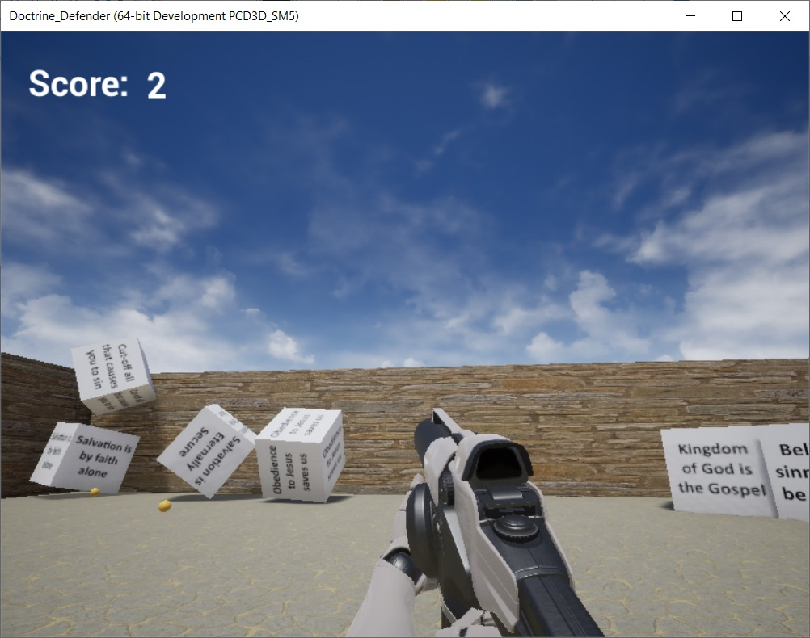

# Doctrine-Defender

## About
Doctrine Defender is a simple 3D shooter game built using Unreal Engine 4, that requires you to remove all false doctrines from the arena by shooting it. You win by shooting out all false doctrines and throwing them out of the arena and you lose by shooting even one correct doctrine out of the arena. Pre-built executables are available in [releases](https://github.com/fiidau/Doctrine-Defender/releases/latest)

## Screenshot

## Controls
- Arrows for direction
- Mouse to move around
- Alt+Enter to toggle fullscreen
- Escape to quit the game
